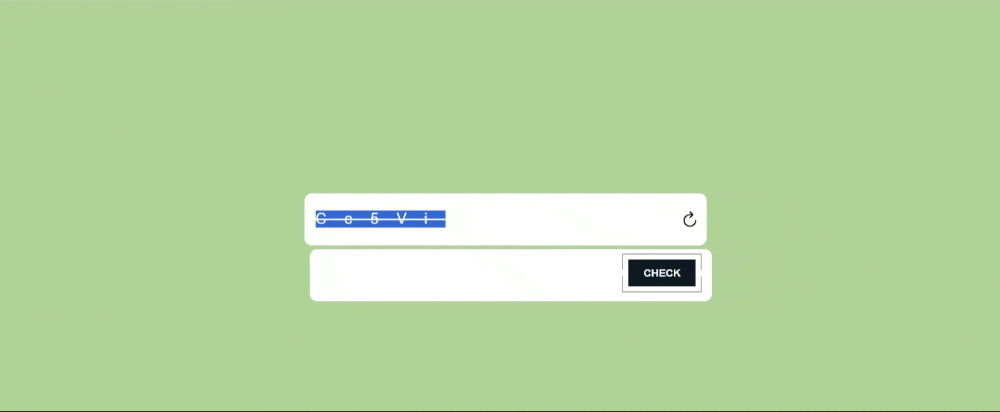

# Simple Captcha Verification

This is a simple web application that generates a captcha when a button is clicked. The user is then prompted to enter the captcha text into an input field. Upon submission, the application verifies if the entered text matches the captcha.

## Features

- Generates a random captcha containing a combination of uppercase letters, lowercase letters, and digits.
- Displays the captcha with strike-through text decoration and increased letter spacing for better visibility.
- Verifies if the entered text matches the captcha.
- Provides feedback to the user about the verification status using an alert.

## Technologies Used

- HTML
- CSS
- JavaScript

## How to Use

1. Clone this repository to your local machine.
2. Open the `index.html` file in a web browser.
3. Click on the "Generate Captcha" button to generate a new captcha.
4. Enter the captcha text into the input field.
5. Click on the "Verify" button to verify the entered text.
6. An alert will appear indicating whether the entered text matches the captcha.

