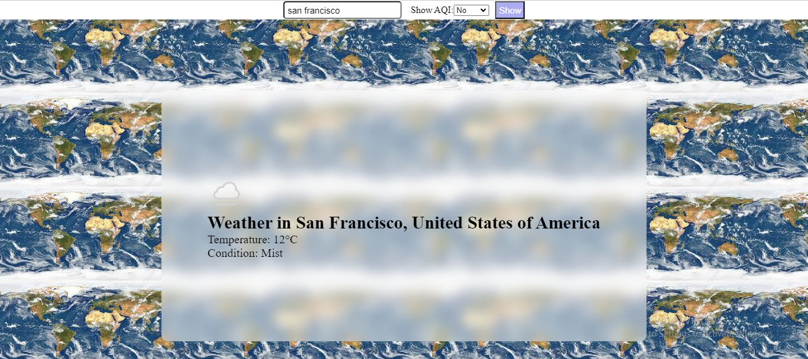
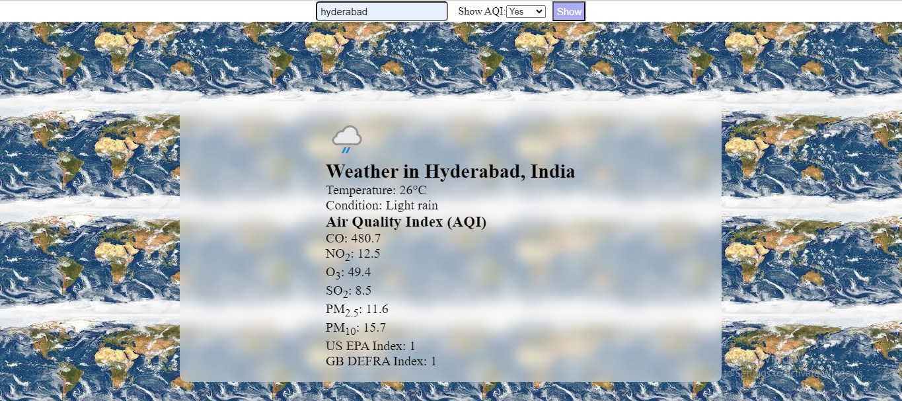

# Weather App

This is a simple weather application that allows users to get weather information for a specific city. Users can choose to display the Air Quality Index (AQI) along with the weather data.

## Features

- Enter the name of the city to get weather information.
- Option to display Air Quality Index (AQI) for the chosen city.
- Clean and intuitive user interface.
- Responsive

## Screenshots

*Weather App - with out AQI Display*

*Weather App with AQI Display*

## Usage

1. Enter the name of the city in the input field provided.
2. Select whether to display the Air Quality Index (AQI) from the dropdown menu.
3. Click the "Show" button to retrieve weather information.

## Hosting

This application is hosted on [City View Forecast](https://cityviewforecast.netlify.app/).

## Technologies Used

- HTML
- CSS
- JavaScript

## Installation

1. Clone the repository: `git clone https://github.com/your-username/weather-app.git`
2. Navigate to the project directory: `cd weather-app`
3. Open `index.html` in your web browser.
